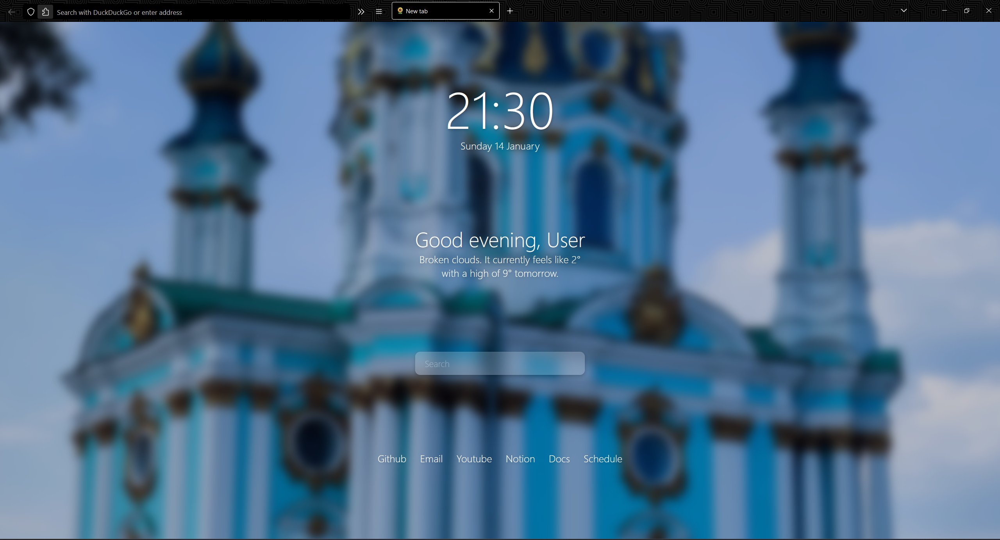

# firefox-config

## Description

This is a simple and beautiful Firefox configuration. It uses custom start page inspired by [Fxzzi startpage](https://www.reddit.com/r/startpages/comments/12iiaf0/oc_multitheme_startpage/), [Pitch Black](https://addons.mozilla.org/en-US/firefox/addon/gj-pitch-black/) theme and custom CSS file for hiding some buttons and creating one-liner inspired by [Waterfall](https://github.com/crambaud/waterfall).

## Installation

### Theme

Install [Pitch Black](https://addons.mozilla.org/en-US/firefox/addon/gj-pitch-black/) theme.

### One liner

1. In the `about:config` page in your Firefox browser, set the following parameters to **True** (by double clicking):

   - `toolkit.legacyUserProfileCustomizations.stylesheets`
   - `layers.acceleration.force-enabled`
   - `gfx.webrender.all`
   - `svg.context-properties.content.enabled`

2. Import unzipped **chrome** directory into your profile folder. Your path to the **chrome** folder should look like this:

   - On Linux : `$HOME/.mozilla/firefox/######.default-release/chrome/`
   - On Windows : `C:\Users\[USERNAME]\AppData\Roaming\Mozilla\Firefox\Profiles\######.default-release\chrome\`
   - On MacOS : `Users/[USERNAME]/Library/Application Support/Firefox/Profiles/######.default-release/chrome`

### Start page

Installed **chrome** directory contains **/startpage**. Copy the path to the index.html file that is contained there. The path should look like this:

`file:///C:/Users/user/AppData/Roaming/Mozilla/Firefox/Profiles/abc12345.default-release/chrome/startpage/index.html`

Enter the path into `Firefox settings -> Home -> New widnows and tabs -> Custom URL-adresses.`  
This will set it up as the start page when opening your browser.

To make it work for new tabs see ["PSA: How to set a custom new tab page in Firefox."](https://www.reddit.com/r/startpages/comments/g3qndt/psa_how_to_set_a_custom_new_tab_page_in_firefox/)

To update links modify the `data` object in `/startpage/src/js/links.js`

## License

See [LICENSE](LICENSE).
