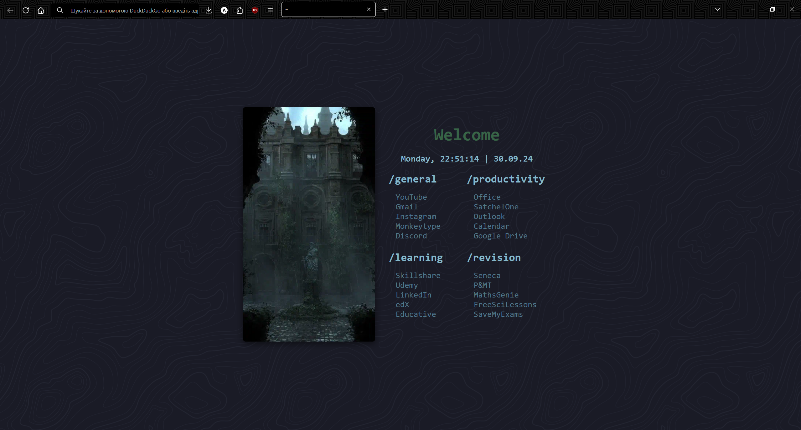

# firefox-config

## Description

This is a simple and beautiful Firefox configuration. It uses [Bonjourr](https://addons.mozilla.org/en-US/firefox/addon/bonjourr-startpage/) start page, [Pitch Black](https://addons.mozilla.org/en-US/firefox/addon/gj-pitch-black/) theme and custom CSS file for hiding some buttons and creating one-liner inspired by [Waterfall](https://github.com/crambaud/waterfall).

## Installation

### Start page

Install [Bonjourr](https://addons.mozilla.org/en-US/firefox/addon/bonjourr-startpage/) extension.

In the settings (bottom right corner of the new tab) import the **bonjourr.json** file.

### Theme

Install [Pitch Black](https://addons.mozilla.org/en-US/firefox/addon/gj-pitch-black/) theme.

### One liner

1. In the `about:config` page in your Firefox browser, set the following parameters to **True** (by double clicking):

   - `toolkit.legacyUserProfileCustomizations.stylesheets`
   - `layers.acceleration.force-enabled`
   - `gfx.webrender.all`
   - `svg.context-properties.content.enabled`

2. Import unzipped **chrome** directory into your profile folder. Your path to the **chrome** folder should look like this:

   - On Linux : `$HOME/.mozilla/firefox/######.default-release/chrome/`
   - On Windows : `C:\Users\[USERNAME]\AppData\Roaming\Mozilla\Firefox\Profiles\######.default-release\chrome\`
   - On MacOS : `Users/[USERNAME]/Library/Application Support/Firefox/Profiles/######.default-release/chrome`

## License

See [LICENSE](LICENSE).
